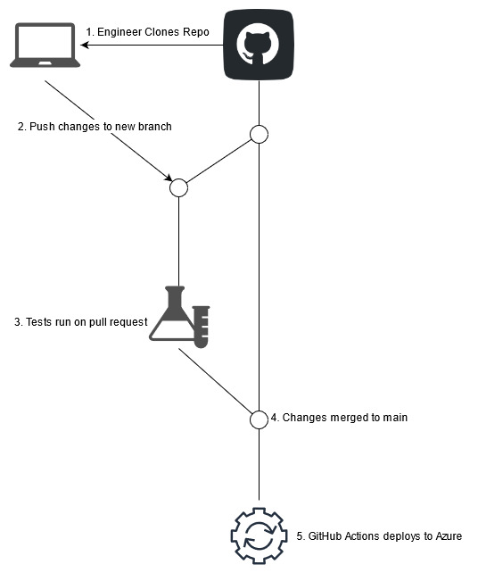
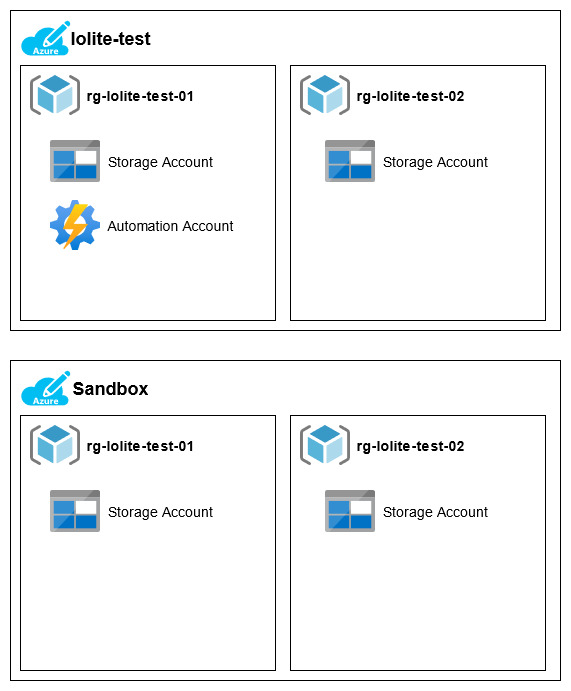

# lolite-sample-project

This is a sample project for [lolite](https://github.com/NathanKewley/lolite), an Azure Bicep orchestration tool. 

This deployes some basic infrastructure into Azure to show some key features of lolite:

* Cross subscription deplots
* Output / dependancy chaining
* Pre and Post hooks
* Integration into a CI/CD pipeline

This project is referenced in the following blog posts:

* [orchestrate-azure-bicep-deploys-with-lolite](https://nathan.kewley.me/2021-04-20-orchestrate-azure-bicep-deploys-with-lolite/)
* [Deploy to Azure with lolite and GitHub Actions](https://nathan.kewley.me/2021-05-29-deploy-to-azure-using-lolite-and-github-actions/)

## CI/CD Layout

The workflow here will look like:

## What gets deployed

The end result in Azure looks like the following:

